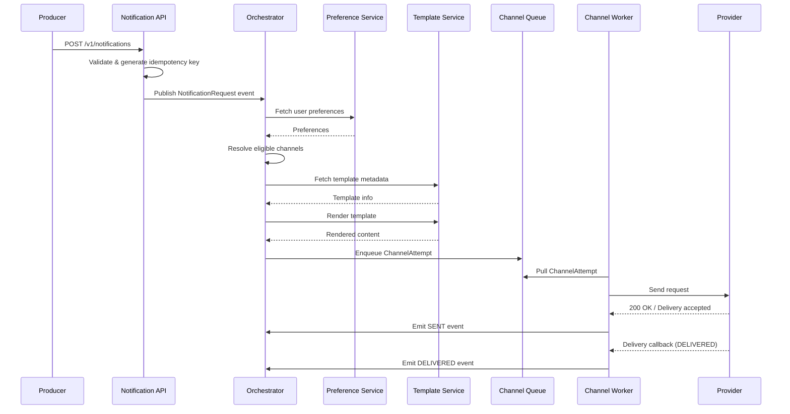
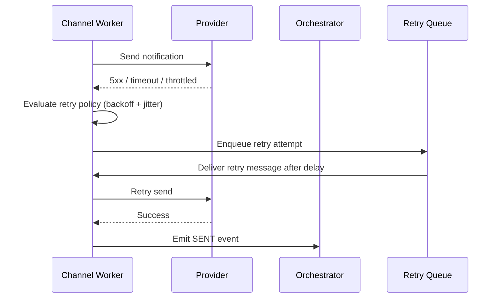
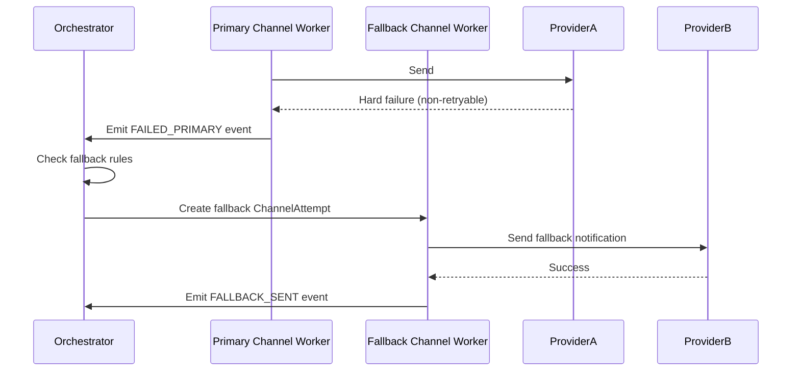
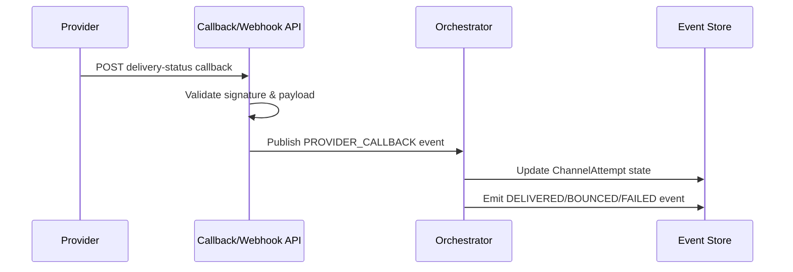
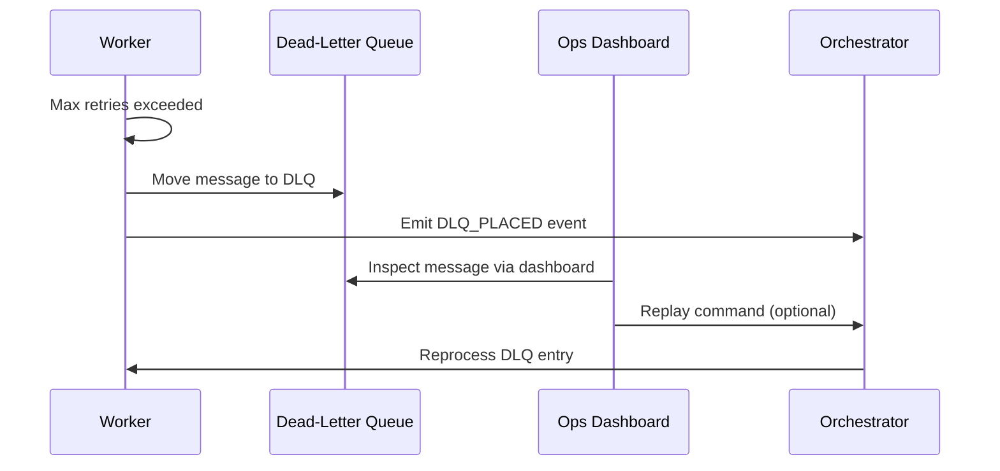
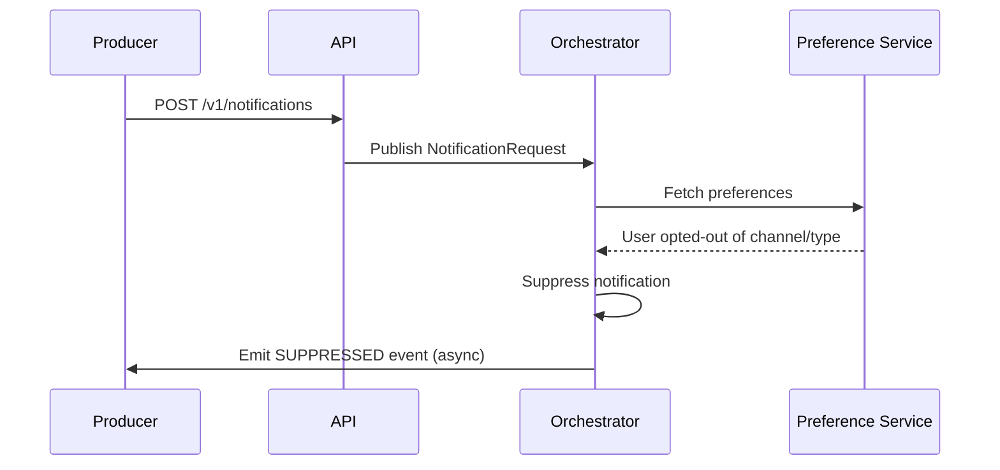
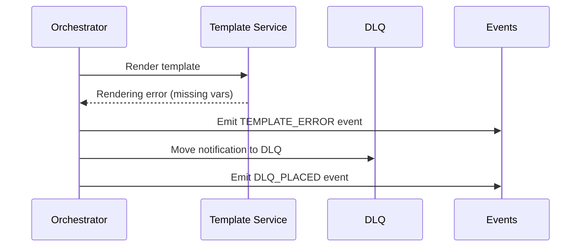
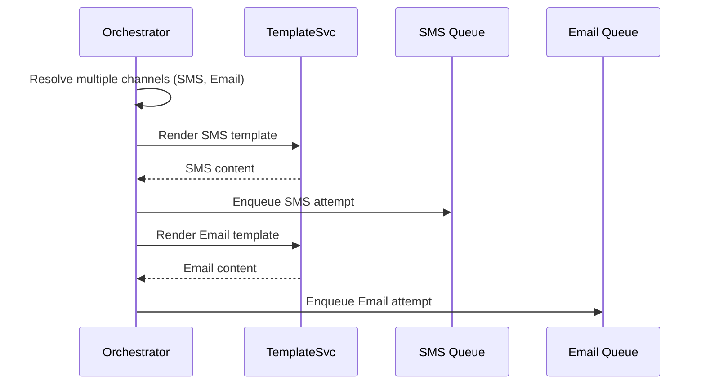
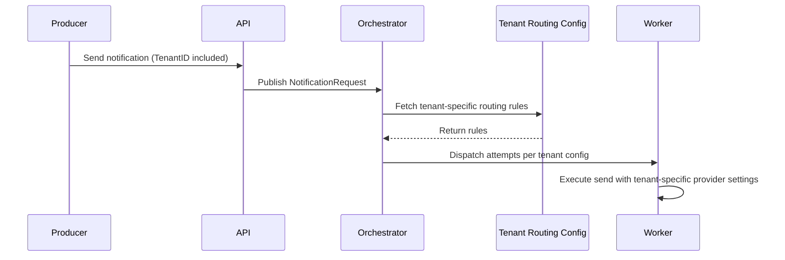

[← Table of Contents](../../README.md)

## Appendix A: Sequence Diagrams

This appendix provides sequence diagrams illustrating the end-to-end flows of the notification platform.  
These diagrams cover the most important operational scenarios: request ingestion, routing, rendering, channel delivery, retries, fallback flows, and provider callbacks.

---

### A1. Notification Request → Delivery (Happy Path)

---

### A2. Retry Flow (Transient Provider Failure)

---

### A3. Fallback Flow (Primary Channel Failure → Secondary Channel)

---

### A4. Provider Callback Flow

---

### A5. Dead-Letter Queue Handling

---

### A6. Preference-Based Suppression Flow

---

### A7. Template Rendering Failure Flow

---

### A8. Multi-Channel Expansion Flow (e.g., SMS + Email)

---

### A9. Multi-Tenant Routing Flow

---
[← Table of Contents](../../README.md)