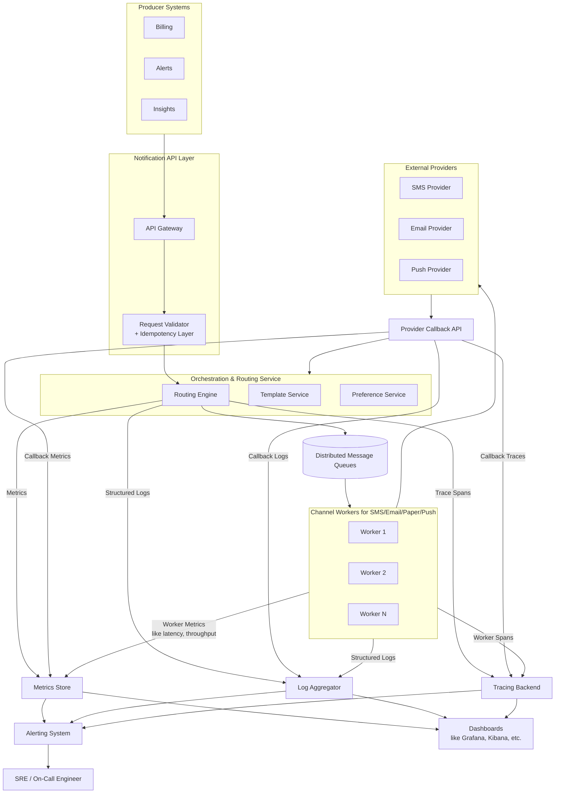

[← Table of Contents](../../README.md)

[← Previous page: Security, Privacy & Compliance](9_security_privacy_compliance.md)

## Observability & Operational Excellence

This section describes how the notification platform provides deep visibility into system behavior, delivery success, provider health, performance bottlenecks, failures, and operational risks.  
Observability is essential in a distributed, asynchronous architecture where failures may occur across multiple components and external providers.

The platform implements observability using **logs**, **metrics**, **traces**, **dashboards**, **alerts**, and **operational workflows**.

---

### Observability Goals

- Provide end-to-end visibility into notification flow.  
- Quickly diagnose issues across routing, rendering, channel services, and providers.  
- Detect anomalies (e.g., spike in failures, queue buildup).  
- Instrument system health for autoscaling decisions.  
- Support compliance and audit requirements.  

---

### Metrics

Metrics enable real-time monitoring and trend analysis.

#### Core Metrics (Global)
- **Total notifications received**  
- **Notifications processed per channel**  
- **End-to-end latency** (p50, p95, p99)  
- **Queue depth per channel**  
- **Worker utilization per channel**  
- **DLQ size and growth rate**  

#### Provider-Specific Metrics
- Delivery success rate  
- Bounce/block rate  
- Provider latency percentiles  
- Throttling/429 counts  
- Failover events triggered  
- Error type breakdown (timeouts, 5xx, 4xx, network errors)  

#### Rendering & Routing Metrics
- Template rendering time  
- Cache hit/miss rate for templates and preferences  
- Routing decision latency  
- Frequency of fallback decisions  
- Invalid or malformed requests  

#### Preference & Template Management Metrics
- Preference update frequency  
- Template version usage distribution  

These metrics feed autoscaling, alerting, and SLA reporting.

---

### Logging

All logs must be **structured**, **correlatable**, and **PII-safe**.

#### Logging Principles
- Use structured JSON logging for machine parsing.  
- Never log sensitive fields (email, phone, address, payload content).  
- Include **correlation IDs** across request → routing → rendering → channel → provider callback.  
- Include timestamps with consistent time standard (UTC).  

#### Log Types
- **Application logs:** routing decisions, errors, processing details  
- **Provider logs:** request/response metadata  
- **Retry logs:** retry counts, backoff decisions  
- **Fallback logs:** triggered fallback events  
- **DLQ logs:** poison messages and root-cause indicators  

---

### Tracing

Distributed tracing enables visibility across asynchronous boundaries.

#### Trace Coverage
Traces span:

1. API ingress  
2. Routing & preference lookups  
3. Template rendering  
4. Channel queue publish  
5. Channel service processing  
6. Provider calls  
7. Provider callback webhooks  

#### Trace Requirements
- Each span includes latency, status, metadata.  
- Correlation ID propagated in headers and message queues.  
- Compatible with tracing frameworks (OpenTelemetry, Jaeger, Zipkin).  

Tracing is essential for diagnosing high-latency channels or intermittent provider failures.

---

### Dashboards

Dashboards provide both real-time and historical visibility.

#### Recommended Dashboards
1. **System Overview**  
   - Requests per second  
   - Queue depth  
   - Error rate  
   - Latency heatmaps  

2. **Channel Performance**  
   - Per-channel throughput  
   - Delivery success/failure  
   - Provider comparison  

3. **Provider Health Dashboard**  
   - Latency  
   - Error distribution  
   - Failover frequency  
   - Rate limiting  

4. **Routing & Template Dashboard**  
   - Rendering time  
   - Cache hit rate  
   - Top notification types  

5. **Operational Dashboard**  
   - DLQ volume  
   - Retry volume  
   - SLA breaches  
   - Alert history  

Dashboards enable SRE and engineering teams to proactively detect issues before customers notice.

---

### Alerting Strategy

Alerts should fire only on actionable events.

#### Critical Alerts (PagerDuty/On-Call)
- Sudden spike in provider failures  
- Queue depth exceeds threshold for a sustained period  
- Worker pools unable to keep up with load  
- Delivery success rate drops below SLA  
- Provider response latency spikes  
- DLQ accumulation above threshold  
- Template rendering failures over threshold  

#### Warning Alerts
- Preference service cache miss rate too high  
- Slow provider degradation (not yet full outage)  
- High retry rate for a specific channel  

#### Info Alerts
- Fallback events increasing gradually  
- Provider failover-switch frequency  

Alert noise must be minimized; thresholds should be tuned using historical data.

---

### Operational Excellence

Operational excellence ensures the platform is maintainable, debuggable, and resilient.

#### Key Practices
- Immutable infrastructure and automated deployments  
- Blue/green or rolling updates for channel services  
- Feature flags for:
  - Routing changes  
  - Template updates  
  - Provider migration  
  - New channels  
- Automated chaos testing (provider outage simulations)  
- Runbooks for common operational scenarios  
- Automated data retention & PII scrubbing workflows  

---

### Runbooks & Incident Response

Each of the following should have dedicated runbooks:

- Provider outage handling  
- Channel queue overflow  
- Template rendering failures  
- Preference store latency issues  
- DLQ inspection & replay  
- Misconfiguration of routing rules  
- Autoscaling anomalies  

Runbooks must include:
- Expected symptoms  
- Diagnostics steps  
- Recovery actions  
- Escalation path  

---

### Post-Incident Analysis & Continuous Improvement

After significant incidents:

- Perform structured root-cause analysis (RCA).  
- Identify systemic issues (e.g., missing metrics, weak fallback rules).  
- Implement hardening tasks (backoff tuning, configs, better health scoring).  
- Feed learnings into product and SRE roadmap.  

---

### Observability Flow Diagram

The above diagram illustrates:
- Logs, metrics, and traces emitted from API, routing, rendering, workers, and provider integrations  
- Observability stack (Prometheus, Grafana, ELK, OpenTelemetry, etc.)  
- Alerting and SLO evaluation paths  

---
[→ Next page: Extensibility & Multi-tenancy](11_extensibility_multi_tenancy.md)

[← Table of Contents](../../README.md)