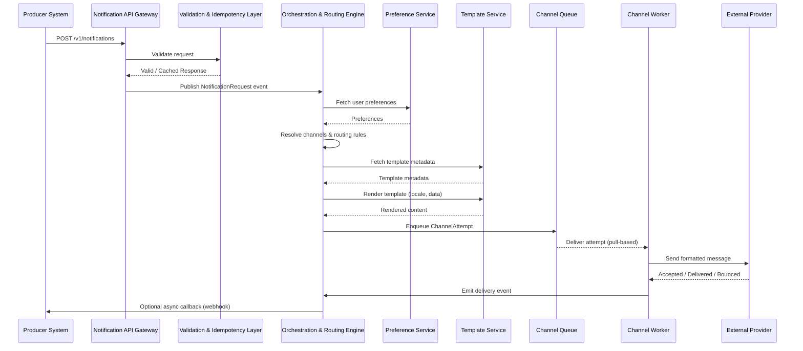

[← Table of Contents](../../README.md)

[← Previous page: Core Domain Model](5_core_domain_model.md)

## Detailed System Design

This section breaks down the major subsystems of the notification platform, how they interact, and the design principles behind each.  
The design emphasizes modularity, scalability, extensibility, and clear separation of concerns.

---

### Unified Notification API (Agnostic Interface)

The Notification API provides a single, channel-agnostic entry point for all producer systems. Producers specify *what* to send, not *how* it is delivered.

#### Responsibilities
- Accept notification requests through a consistent API.
- Validate payloads and required fields.
- Enforce authentication, authorization, and rate limits.
- Generate idempotency keys to prevent duplicates.
- Persist initial audit events (e.g., `REQUEST_RECEIVED`).
- Publish normalized events into the orchestration pipeline (queues/streams).

#### Core Principles
- Producers remain fully decoupled from channel/provider complexity.
- The API remains stable even as templates, channels, or providers change.
- Synchronous errors relate only to request validity, not downstream delivery.

#### Example API Contract (Simplified)
```
POST /v1/notifications
{
  "notificationType": "high_usage_alert",
  "userId": "12345",
  "payload": { "usage": 522, "threshold": 450 },
  "priority": "high",
  "idempotencyKey": "abc123-xyz789"
}
```

#### Diagram: API Flow



---

### Orchestration & Routing

This subsystem determines **how** a notification should be delivered based on preferences, routing rules, tenant configuration, and fallback logic.

#### Responsibilities
- Expand a single `NotificationRequest` into one or more `ChannelAttempt` objects.
- Evaluate:
  - User preferences and opt-in/out status  
  - Channel priority and fallback order  
  - Tenant-level routing rules  
  - Regulatory constraints  
  - Do-not-disturb windows  
- Apply throttling at user, tenant, or channel level.
- Emit routing-related audit events.

#### Routing Workflow
1. Fetch notification type definition.  
2. Fetch user preferences.  
3. Determine eligible channels.  
4. Filter out channels based on blackout windows and consent.  
5. Apply priority/fallback ordering.  
6. Generate channel-specific tasks.

Routing happens **before** template rendering to reduce unnecessary work.

---

### Templating & Personalization

Templates define the structure of messages for each channel. Personalization merges dynamic payload data with template placeholders.

#### Responsibilities
- Manage versioned templates per channel, locale, and tenant.
- Render personalized content using payload and user attributes.
- Ensure deterministic output for audit and debugging.
- Handle localized fallbacks (e.g., missing `fr-CA` → fallback to `en-US`).
- Cache frequently used templates or fragments.

#### Rendering Flow
1. Fetch template metadata (channel + locale + version).  
2. Merge payload with variables.  
3. Apply sanitization and formatting rules.  
4. Produce channel-ready content (HTML, text, JSON, PDF, etc.).

Paper notifications may require a rendering pipeline that outputs printable documents (PDF/HTML-to-PDF).

---

### User Preferences Service

This service acts as the authoritative source for all routing-related user preference data.

#### Responsibilities
- Store preferences per notification type and user.
- Maintain opt-in/out, DND windows, preferred channels.
- Expose a low-latency read API for routing.
- Merge preferences from:
  - Global defaults  
  - Tenant-level configuration  
  - User-specific overrides  
- Propagate preference updates through event streams.

#### Data Characteristics
- Heavy read, light write.
- Ideally stored in a distributed KV or NoSQL store.
- Cached for low-latency lookups (<5ms target).

---

### Channel Services & Third-Party Provider Integrations

Each channel is implemented as an independent component that encapsulates provider-specific logic.

#### Responsibilities
- Consume channel attempts from channel-specific queues.
- Format outbound messages according to provider specs.
- Apply provider rate limits and adaptive throttling.
- Select an appropriate provider (active-active or failover).
- Handle retries and fallback logic.
- Record provider responses (success, throttled, bounced, failed).

#### Design Principles
- All channels expose a common interface (e.g., `send(attempt)`).
- Providers abstracted behind adapters.
- Each channel scales based on its own workload demands.

#### Provider Failover Example
1. Try primary provider (e.g., Provider A).  
2. On transient failure → retry with exponential backoff.  
3. On persistent failure → failover to Provider B.  
4. Emit audit events for each transition.

---

### Async Processing & Queues

Asynchronous processing ensures high throughput, isolation, and resilience.

#### Responsibilities
- Buffer workloads during traffic spikes.
- Decouple synchronous request handling from downstream delivery.
- Provide isolation between channels.
- Enable prioritized processing for critical alerts.
- Provide dead-letter queues for failed messages.

#### Queue Strategy
- **Per-channel queues** for isolation.  
- Optional **priority queues** (high → normal → bulk).  
- Optional **per-tenant queues** for noisy-neighbor containment.

#### Worker Behavior
- Pull tasks from queue.
- Perform template rendering (if not pre-rendered).
- Deliver through provider adapter.
- Update state machine (sent, delivered, failed, retrying).
- On repeated failure → DLQ.

---

### Data Storage

Multiple purpose-fit data stores support scalability, auditability, and performance.

#### Components

##### Relational Database
Stores:
- Notification types  
- Template metadata  
- Provider configurations  
- Tenant routing rules  

##### NoSQL / KV Store
Stores:
- User preferences  
- Provider health indicators  
- Cached routing configurations  

##### Time-Series / Log Store
Stores:
- Notification events  
- Channel attempt logs  
- Provider callbacks  

##### Cache (Redis-like)
Used for:
- Preferences  
- Routing configuration  
- Template fragments  
- Provider health snapshots  

#### Data Retention & Compliance
- Notification payloads may be redacted or stored with TTL.
- Sensitive fields may use field-level encryption.
- Audit logs retained based on compliance needs.

---
[→ Next page: Scalability & Performance](7_scalability_performance.md)

[← Table of Contents](../../README.md)