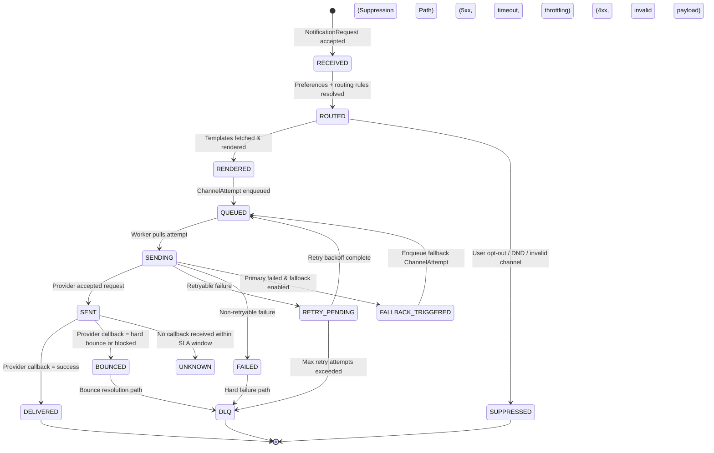

[← Table of Contents](../../README.md)

[← Previous page: Scalability & Performance](7_scalability_performance.md)

## Reliability, Fault Tolerance & Delivery Semantics

This section describes how the notification platform guarantees reliable delivery, handles provider/service failures, manages retries and fallbacks, and ensures auditability.  
Given the platform operates at scale and integrates with external providers, reliability must be built into every layer.

---

### Failure Modes

The system must anticipate and gracefully handle failures across multiple layers:

#### **1. Provider-Level Failures**
- Transient outages (network hiccups, DNS failures)
- Hard failures (provider down)
- Rate limiting (HTTP 429 / throttling)
- Misconfigured credentials
- High latency or slow responses
- Delivery rejections (invalid email/phone)

#### **2. Internal System Failures**
- Worker crashes or restarts
- Queue backpressure or saturation
- DB or cache unavailability
- Preference service latency spikes
- Template rendering failures

#### **3. Data-Related Failures**
- Missing required fields in payload
- Unsupported locale for templates
- Invalid routing rules
- User preferences in inconsistent state

#### **4. Cross-Service Failures**
- Network partitions
- Region-specific outages (cloud provider issues)
- Deadlocks or contention in shared stores

A robust fault-tolerant design must isolate these failures and minimize blast radius.

---

### Delivery Semantics & Idempotency

Distributed systems cannot guarantee exactly-once delivery. Therefore, the platform adopts:

### **At-Least-Once Delivery + Idempotency Guarantees**

#### Why this model?
- Works reliably with external providers
- Allows retries without user-facing duplicates
- Keeps architecture simpler than exactly-once systems

#### Implementation Details
- Each `NotificationRequest` includes an **idempotency key**
- Duplicate requests with the same key return the original result
- `ChannelAttempt` entities include:
  - Deterministic identifiers
  - Hash-based dedupe keys on user/channel/type
- State machine transitions must be **idempotent**
- Provider callbacks may arrive out of order; logic normalizes them

#### Idempotency Protection
- Cache or KV-based dedupe window (e.g., 24–48 hours)
- Channel-attempt-level dedupe to prevent repeated sends

---

### Retry & Backoff Strategies

Retries are essential for reliability but must be controlled to avoid provider overload.

#### Retry Triggers
- Network timeouts
- 5xx provider errors
- 429 rate-limit responses
- Transient DNS or TLS errors
- Intermittent internal failures (e.g., worker crash)

#### Retry Strategy
- **Exponential backoff with jitter**
- Channel-specific retry rules:
  - SMS retry bucket (stricter throttling)
  - Email retry bucket (more forgiving)
  - Paper delivery → no retry; job flagged for manual inspection
- Maximum retry attempts per channel (configurable)
- Certain failures are *non-retryable*, e.g.:
  - Invalid addresses
  - Permanently blocked numbers/emails

#### Retry Scheduling
- Retries are queued separately to avoid mixing with new traffic
- Retry queues have lower priority than real-time queues

---

### Dead-Letter Queues (DLQs)

Messages that repeatedly fail or are malformed must be isolated.

#### When a message is moved to DLQ?
- Reaches max retry threshold
- Validation failure after ingestion
- Irrecoverable provider errors (invalid content, invalid destination)
- Internal corruption in payload

#### DLQ Benefits
- Prevents retry storms
- Protects system from poison messages
- Enables operational visibility into failure patterns

#### DLQ Handling Workflow
1. Move message to DLQ  
2. Emit audit event (`DLQ_PLACED`)  
3. Trigger alert for operational team  
4. Provide replay or manual intervention tools  

---

### Fallback Logic

Fallback ensures that critical notifications reach users even if primary channels fail.

#### Example Scenarios
1. SMS provider is down → attempt email  
2. Email bounces → attempt push  
3. Push provider timeout → attempt SMS  
4. For regulatory messages → fallback is not allowed (must send via required channel)

#### Fallback Rules
- Defined per notification type
- Can be tenant- or user-specific
- Respect user preference restrictions
- Logged in audit trail  
- Fallback attempts do not cause duplicate user deliveries

---

### Notification State Machine

A state machine ensures every notification and channel attempt transitions through well-defined states.

#### Recommended States
- `RECEIVED` — Request accepted  
- `ROUTED` — Channels determined  
- `RENDERED` — Template rendered  
- `QUEUED` — Channel attempt queued  
- `SENT` — Provider accepted  
- `DELIVERED` — Provider confirmed  
- `FAILED` — Non-recoverable failure  
- `RETRY_PENDING` — Scheduled for retry  
- `FALLBACK_TRIGGERED` — Primary channel failed  
- `DLQ` — Moved to dead-letter queue  

Each transition emits an audit event.

#### Diagram

---

### Provider Monitoring & Health Awareness

To ensure reliability and optimal routing, the system collects:

- Provider latency percentiles (p50, p95, p99)
- Error rates (4xx, 5xx, timeouts)
- Throughput metrics
- Rate-limit responses
- Bounce/block events

A **provider health score** is computed and used by routing logic.

#### If provider health degrades:
- Traffic automatically diverts to another provider
- Retry attempts for degraded provider slow down
- Alerts sent to operational teams

---

### Circuit Breakers & Bulkheading

To prevent cascading failures:

#### Circuit Breakers
- Trip when error rate exceeds thresholds
- Autosuspend calls to unhealthy provider for cooldown period
- Protects workers from waiting on unresponsive endpoints

#### Bulkheading
- Channel queues isolate failure domains
- Worker pools split by channel and priority
- Provider adapters isolated so a problematic provider doesn’t take down the channel

---

### High Availability & Resiliency Strategies

- Stateless services replicated across zones
- Queueing backend with replication and multi-AZ durability
- Database backups + point-in-time recovery
- Auto-healing (restarting failed workers)
- Horizontal autoscaling based on:
  - Queue depth  
  - CPU usage  
  - Latency spikes  
  - Failure rate  

---

### Observability for Reliability

Deep visibility is essential for diagnosing failures.

#### Emit metrics for:
- Success/failure rates per channel
- Provider latency & error spikes
- Retry counts
- DLQ size and growth
- End-to-end delivery latency
- Template rendering time

#### Logging:
- Structured logs with correlation IDs
- Minimal exposure of PII

#### Tracing:
- Trace spans across:
  - Ingress → routing → rendering → channel → provider callback

SLIs & SLOs recommended:
- 99.9% of SMS delivered within X seconds
- 99.9% routing decisions in <20ms
- Retry rate below Y%
- DLQ accumulation < threshold

---
[→ Next page: Security, Privacy & Compliance](9_security_privacy_compliance.md)

[← Table of Contents](../../README.md)